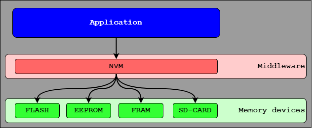
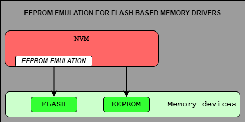
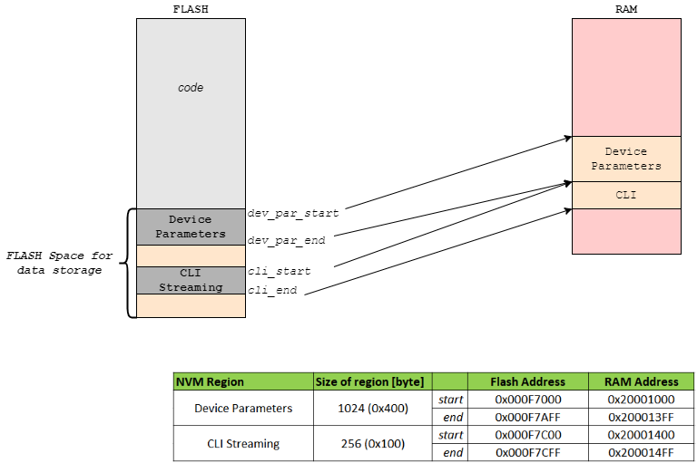
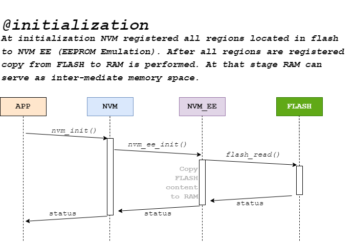
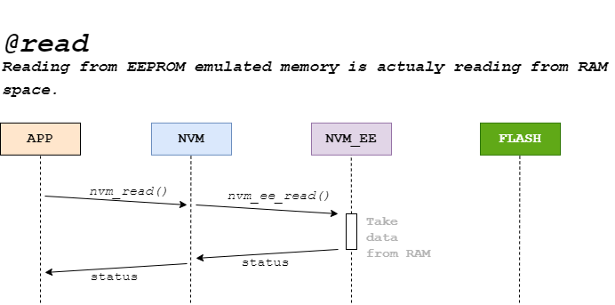

# **NVM - Non Volatile Memory module**

Non-volatile memory (NVM) module is implemented in C and it provides application layer abstaraction from actual memory space or memory device. Meaning that application code don't need to know where persistant informations will be stored and how it will be handled in the end memory device. Picture below shows described arhitecture:



Following arhitecture provides single interface between application and memory devices as NVM module interfaces with end memory device drivers. Therefore if any of the memory device gets change only NVM module needs to adopt to that change.

NVM module can interface with one or multiple memory device drivers and furthermore provides memory space spliting into regions. Memory drivers and regions are configurable via **nvm_cfg.c/.h** files.

## **Dependencies**

### **1. Memory device low level driver**
In order to make sense to use NVM at least one memory device driver must be linked to NVM module. Interface between NVM module and memory device driver is predefined. Meaning that all drivers shall have following function prototypes:
 - *mem_status_t mem_drv_init(void)*
 - *mem_status_t mem_drv_deinit(void)*
 - *mem_status_t mem_drv_write(const uint32_t addr, const uint32_t size, const uint8_t * const p_data)*
 - *mem_status_t mem_drv_read(const uint32_t addr, const uint32_t size, uint8_t * const p_data)*
 - *mem_status_t mem_drv_erase(const uint32_t addr, const uint32_t size)*

**IMPORTANT: Memory drivers must return status code compatible with NVM module. Memory driver API functions shall return 0 in case of no errors!!!**

Therefore memory driver shall define status as:
```C
/**
 * 	Memory driver status
 */
typedef enum
{
	eMEM_DRV_OK         = 0,		/**<Normal operation status code */
	eMEM_DRV_ERROR_1    = 0x01,		/**<Error 1 status code */
	eMEM_DRV_ERROR_2    = 0x02,		/**<Error 2 status code */
	eMEM_DRV_ERROR_3    = 0x04,		/**<Error 3 status code */

	// ...
} mem_status_t;
```

Function pointers structure definition for memory drivers:
```C
/**
 * 	Memory device driver
 */
typedef struct nvm_mem_driver_s
{
	nvm_status_t (*pf_nvm_init)   (void);
	nvm_status_t (*pf_nvm_deinit) (void);
	nvm_status_t (*pf_nvm_write)  (const uint32_t addr, const uint32_t size, const uint8_t * const p_data);
	nvm_status_t (*pf_nvm_read)   (const uint32_t addr, const uint32_t size, uint8_t * const p_data);
	nvm_status_t (*pf_nvm_erase)  (const uint32_t addr, const uint32_t size);
} nvm_mem_driver_t;
```

**NOTICE: In case memory drivers don't have all of the wanted functions, NULL value can be placed inside interface configuration table.**
Example of not having de-initialization function provided by memory driver:
```C
// EEPROM LOW LEVEL MEMORY DRIVER
[eNVM_MEM_DRV_EEPROM ] = 
{
	.pf_nvm_init   = (nvm_status_t (*)(void))                                                                   _24aa64t_init,
	.pf_nvm_deinit = NULL,
	.pf_nvm_write  = (nvm_status_t (*)(const uint32_t addr, const uint32_t size, const uint8_t * const p_data)) _24aa64t_write,
	.pf_nvm_read   = (nvm_status_t (*)(const uint32_t addr, const uint32_t size, uint8_t * const p_data))       _24aa64t_read,
	.pf_nvm_erase  = (nvm_status_t (*)(const uint32_t addr, const uint32_t size))                               _24aa64t_erase,
}
```


## **General Embedded C Libraries Ecosystem**
In order to be part of *General Embedded C Libraries Ecosystem* this module must be placed in following path: 
```
root/middleware/nvm/nvm/"module_space"
```

## **EEPROM Emulation**
NVM modules has integrated EEPROM emulation techniques for interfacing with Flash based memory devices as with EEPROM device. In other words EEPROM emulation is responsible for making abstration of Flash memory device, thus NVM modules "thinks" it works with EEPROM device.  EEPROM emulation is a sub-module integrated within NVM module. Picture below shows place of EEPROM emulation within NVM module:



### Problem
On the surface, the main difference between Flash memory and EEPROM memory is the size of an individually-
modifiable  area.  On  most  EEPROM  devices,  memory  can  be  modified  one  byte  at  a  time.  However,  on  flash
devices, memory is typically organized into “pages” consisting of a larger number of bytes. These pages must be
erased (writing 1s to all bits) one full page at a time, while individual bits can be written to zero. To emulate byte-
writeable EEPROM memory in a Flash device, it is necessary to perform a **read-modify-write operation**. (Source: Silicon Labs AppNote [AN568](https://www.silabs.com/documents/public/application-notes/AN568.pdf))

### Solution
In order to make an abstration of EEPROM for flash based device, RAM memory will be used as inter-mediate medium of informations. Therefore each informations inside NVM region that will use driver with EEPROM emulation enabled will be copied to RAM, modified in RAM and then copied back to Flash.

Mapping of Flash NVM regions to RAM is shown in picture below. Note that user defined NVM regions might not be consecutive, therefore there is space in flash between two represented regions. But there is no space in RAM space, as it serves only for inter-mediate memory.



### Sequence diagrams of operation

#### **1. Initialization of EEPROM Emulated flash memory**



#### **2. Read from EEPROM Emulated flash memory**



#### **3. Erase EEPROM Emulated flash memory**


#### **4. Write & Sync to EEPROM Emulated flash memory**


### Limitation
All regions than uses EEPROM Emulation shall shall be located in same end FLASH page!


## **API**
| API Functions | Description | Prototype |
| --- | ----------- | ----- |
| **nvm_init** | Initialization of NVM module | nvm_status_t nvm_init(void) |
| **nvm_deinit** | De-initialization of NVM module | nvm_status_t nvm_deinit(void) |
| **nvm_is_init** | Get NVM module initialization flag | nvm_status_t nvm_is_init(bool * const p_is_init) |
| **nvm_write** | Write data to NVM region | nvm_status_t nvm_write(const nvm_region_name_t region, const uint32_t addr, const uint32_t size, const uint8_t * const p_data) |
| **nvm_read** | Read data from NVM region | nvm_status_t nvm_read(const nvm_region_name_t region, const uint32_t addr, const uint32_t size, uint8_t * const p_data) |
| **nvm_erase** | Erase data from NVM region | nvm_status_t nvm_erase(const nvm_region_name_t region, const uint32_t addr, const uint32_t size) |

## Usage

**GENERAL NOTICE: Put all user code between sections: USER CODE BEGIN & USER CODE END!**

1. Copy template files to root directory of module.
2. Configure NVM module for application needs. Configuration options are following:

| Configuration | Description |
| --- | --- |
| **NVM_CFG_MUTEX_EN** 	| Enable/Disable multiple access protection. |
| **NVM_CFG_DEBUG_EN** 	| Enable/Disable debugging mode. |
| **NVM_CFG_ASSERT_EN** | Enable/Disable asserts. Shall be disabled in release build! | 
| **NVM_DBG_PRINT** 	| Definition of debug print. | 
| **NVM_ASSERT** 		| Definition of assert. | 


3. List all NVM regions and memory drivers inside **nvm_cfg.h** file as enumerations

```C
/**
 * 	NVM Region options
 *
 * 	@note 	Must always start with 0!
 */
typedef enum
{
	// USER CODE BEGIN...

	eNVM_REGION_EEPROM_RUN_PAR = 0,
	eNVM_REGION_EEPROM_CLI,

	// USER CODE END...

	eNVM_REGION_NUM_OF
} nvm_region_name_t;

/**
 * 	NVM Low-level memory drivers
 *
 * 	@note 	Must always start with 0!
 */
typedef enum
{
	// USER CODE BEGIN...

	eNVM_MEM_DRV_EEPROM = 0,

	// User shall add more here if needed...

	// USER CODE END...

	eNVM_MEM_DRV_NUM_OF
} nvm_mem_drv_name_t;
```

4. Connect memory device low level driver with NVM module

```C
/**
 * 	NVM low-level memory driver
 *
 * 	@brief	User shall specified low level memory drivers API functions
 * 			for defined memory driver.
 *
 * 			Each driver expect four functions: init, write, read and erase with
 * 			exact predefined function prototypes.
 *
 * 	@note	It is important that low level driver return status has the same
 * 			interface. Rule is that 0 means OK, non-zero values means error
 * 			codes. For know NVM module is written that detects only
 * 			error code by checking for 0 return code as enumeration type.
 *
 *
 */
static const nvm_mem_driver_t g_mem_driver[ eNVM_MEM_DRV_NUM_OF ]=
{
	// USER CODE BEGIN...

	// EEPROM LOW LEVEL MEMORY DRIVER
	[eNVM_MEM_DRV_EEPROM ] = 
	{
		.pf_nvm_init   = (nvm_status_t (*)(void))                                                                   _24aa64t_init,
		.pf_nvm_deinit = (nvm_status_t (*)(void))                                                                   _24aa64t_deinit,
		.pf_nvm_write  = (nvm_status_t (*)(const uint32_t addr, const uint32_t size, const uint8_t * const p_data)) _24aa64t_write,
		.pf_nvm_read   = (nvm_status_t (*)(const uint32_t addr, const uint32_t size, uint8_t * const p_data))       _24aa64t_read,
		.pf_nvm_erase  = (nvm_status_t (*)(const uint32_t addr, const uint32_t size))                               _24aa64t_erase,
	},

	// User shall add more here if needed...


	// USER CODE END...
};
```
5. Add NVM region details

```C
/**
 * 		NVM region definitions
 *
 *	@brief	User shall specified NVM regions name, start, size
 *			and pointer to low level driver.
 *
 * 	@note	Special care with start address and its size!
 */
static const nvm_region_t g_nvm_region[ eNVM_REGION_NUM_OF ] =
{
	// USER CODE BEGIN...

	// ----------------------------------------------------------------------------------------------------------------------------------------------------
	//                               Region Name                  Start address           Size [byte]      Low level driver
	// ----------------------------------------------------------------------------------------------------------------------------------------------------

	[eNVM_REGION_EEPROM_RUN_PAR] = { .name = "device parameters", .start_addr = 0x0000,   .size = 1024,    .p_driver = &g_mem_driver[ eNVM_MEM_DRV_EEPROM ] },
	[eNVM_REGION_EEPROM_CLI]     = { .name = "CLI settings",      .start_addr = 0x0400,   .size = 256,     .p_driver = &g_mem_driver[ eNVM_MEM_DRV_EEPROM ] },

	// ----------------------------------------------------------------------------------------------------------------------------------------------------

	// User shall add more here if needed...

	// USER CODE END...
};
```

6. Initialize module

```C
if ( eNVM_OK != nvm_init())
{
    // Error during initialization!
	// Furhter action here...
}
```

7. Write/Read/Erase from/to specified NVM region

```C

// Write example
if ( eNVM_OK != nvm_write( eNVM_REGION_EEPROM_RUN_PAR, 0x100, 10U, (const uint8_t*) &u8_write_data))
{
    // NVM write error!
    // Further actions here...
}

// Read example
par_status_t status 	= ePAR_OK;
uint32_t     sign	= 0UL;

if ( eNVM_OK != nvm_read( eNVM_REGION_EEPROM_RUN_PAR, PAR_NVM_SIGNATURE_ADDR_OFFSET, 4U, (uint8_t*) &sign ))
{
    // NVM read error!
    // Further actions here...
}

// Erase example
// Erase 4 bytes starting from address 0x123 inside RUN_PAR region
nvm_erase( eNVM_REGION_EEPROM_RUN_PAR, 0x123, 4U );

```


### Usage with EEPROM emulation

TODO: ...

